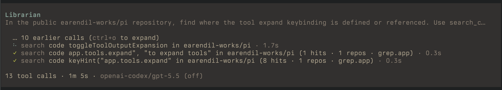
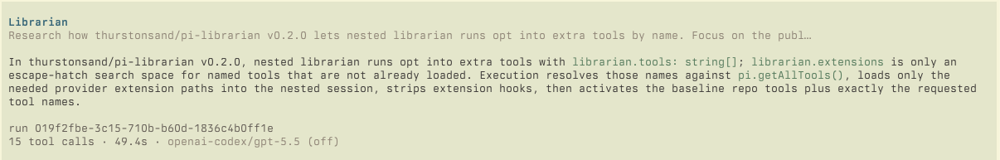

# pi-librarian

A GitHub research subagent for the [pi coding agent](https://github.com/badlogic/pi-mono) inspired by [Amp](https://ampcode.com/): deep-dive questions about specific repos ("how does drizzle-orm implement prepared statements?") and discovery across the ecosystem ("compare the most popular TypeScript SQL ORMs").





## How it works

The `librarian` tool spawns a research subagent with purpose-built tools:

- **`checkout_repo`** — clone into a local cache, where it can be read locally, and `git log -S`/`blame`/`diff` covers history.
- **`search_repos`** — GitHub repository discovery (stars, topics, other metadata).
- **`search_code`** — cross-repo public code search via [Grep](https://grep.app/) (regex, global discovery, repo/language/path filters).
- **`search_github_code`** — GitHub REST code search over public code and private repositories your configured GitHub auth can access.
- **`read_github_file`** — single-file API reads for quick peeks without cloning.

## Usage

- Ask pi a question involving other repos; it asks the `librarian`.
- Ask follow-up questions to earlier librarian runs.
- `/librarian` attaches the research tools directly to your session for direct tool usage.
- Recommended: install [pi-web-access](https://pi.dev/packages/pi-web-access) (or your web search of choice, tho this one is zero-config to get started) and add `web_search`, `fetch_content`, `get_search_content` to `librarian.tools` to expand past GitHub-only research.

## GitHub auth for private repos

Public GitHub reads work without configuration. To let the librarian search and read private GitHub repositories, provide a token in one of these ways:

1. Set `GITHUB_TOKEN` or `GH_TOKEN` in the environment before starting pi.
2. Or authenticate the GitHub CLI so `gh auth token` returns a token:

The token is loaded once per pi session and used for github access in `search_repos`, `search_github_code`, `checkout_repo`, and `read_github_file`. For private repositories, use a token with read access to the target repos.

## Configuration

In pi's global `settings.json`:

```jsonc
{
  "librarian": {
    "model": "openai-codex/gpt-5.5",
    "thinkingLevel": "off",
    "tools": ["web_search", "fetch_content", "get_search_content"],
    "extensions": ["~/.pi/agent/extensions/parallel-web-tools"],
    "cacheDir": "/tmp/pi-librarian",
    "debug": { "persistRuns": false },
  },
}
```

| Setting             | Recommended                                      | Default                        |
| ------------------- | ------------------------------------------------ | ------------------------------ |
| `model`             | `openai-codex/gpt-5.5`                           | current session model          |
| `thinkingLevel`     | `off`                                            | current session thinking level |
| `tools`             | names of extra tools to provide the librarian    | `[]`                           |
| `extensions`        | extra paths to load extensions for the librarian | `[]`                           |
| `cacheDir`          | `/tmp/pi-librarian`                              | `/tmp/pi-librarian`            |
| `debug.persistRuns` | persist nested session file paths for debugging  | `false`                        |

`librarian.extensions` dynamically loads extra extensions just for the librarian. Add any tools from that extension to `librarian.tools` for the librarian to actually be able to use them. Librarian excludes `write` and `edit`.

## Development

```bash
npm run check                       # biome + tsc + vitest
pi -e ./extensions/librarian.ts     # run pi with this extension loaded
```
